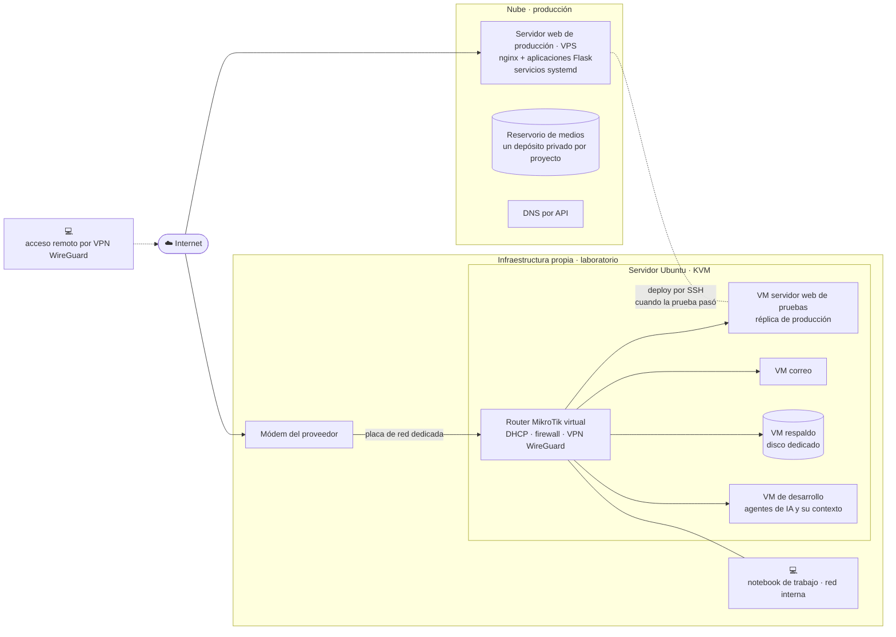
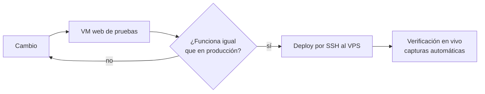
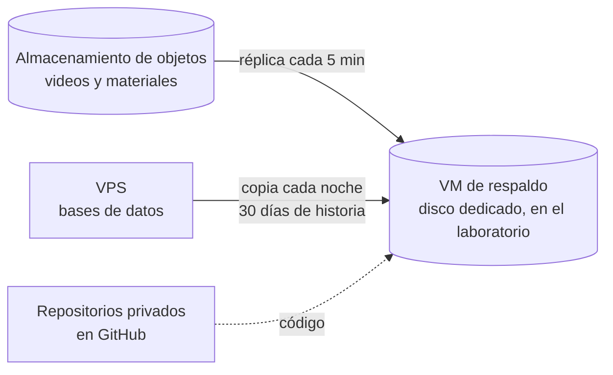

# Infraestructura DruidaTech — laboratorio propio y producción en la nube

La infraestructura sobre la que corren los proyectos web de DruidaTech: un
laboratorio en hardware propio para desarrollar y probar, y un servidor pequeño
alquilado en la nube para producción. Toda la infraestructura, del laboratorio a
la nube, la diseñó, la montó y la opera **Edgardo Rodríguez**.

**Un proyecto que corre sobre esto:**
[artedehoy-web](https://github.com/druidatech-net/artedehoy-web), sitio y
plataforma de cursos en video.

---

## La idea en una frase

Cada web se desarrolla y se prueba en el laboratorio, en hardware propio. Cuando
su funcionamiento está probado, pasa a la nube y entra en producción. El
servidor de correo, en cambio, queda de forma permanente en infraestructura
propia.

---

## Cómo está armado

---

## El laboratorio

**Un solo equipo, que es el servidor.** Un servidor Ubuntu con ocho núcleos y treinta y
dos gigabytes de memoria, dedicado a dos cosas: alojar las máquinas virtuales
con KVM y servir los archivos de la red. Nadie trabaja
sentado frente a ella; su pantalla queda como consola de emergencia.

**El trabajo se hace desde una notebook** conectada a la red interna. Desde ahí
se entra a la máquina de desarrollo y al resto. Y cuando esa misma notebook
está afuera, entra por la VPN WireGuard: mismo puesto de trabajo, adentro o
lejos.

**Cinco máquinas virtuales**, que arrancan solas con el equipo:

| Máquina | Para qué |
|---|---|
| Router MikroTik virtual | El router de entrada de toda la red, con su licencia: recibe la conexión del proveedor por una placa dedicada y hace DHCP con reservas, firewall, apertura de puertos y la VPN WireGuard de acceso remoto. |
| Servidor web de pruebas | Réplica del entorno de producción: mismo nginx, mismas aplicaciones, mismos servicios. Lo que funciona acá, sube. |
| Correo | Servidor de correo completo y propio para todos los dominios de la empresa: buzones, webmail y autenticación del dominio (SPF, DKIM y DMARC), sin depender de un proveedor. |
| Respaldo | Guarda, en un disco dedicado, las copias de lo que vive en la nube: el reservorio de medios (los videos y documentos de cada proyecto, replicados cada cinco minutos) y las bases de datos del servidor de producción (copiadas cada noche, con treinta días de historia). |
| Desarrollo | La máquina donde viven los agentes de inteligencia artificial que asisten el desarrollo y la operación, con todo su contexto: los proyectos, la documentación y las herramientas con las que trabajan. Está adentro de la red, no en internet, y se entra desde cualquier lugar por la VPN: el trabajo sigue igual desde la notebook, de viaje o desde otra ciudad. |

**La red.** El módem del proveedor entra por una placa de red dedicada del
servidor, y el router de entrada es el MikroTik virtual que corre en ese mismo
equipo. Él gobierna todas las máquinas por el puente interno. Cada una recibe
su dirección por DHCP con reserva en el router; ninguna lleva dirección fija
adentro. Es una regla fija: la red se administra desde un solo lugar.

**Acceso remoto.** Desde afuera se entra a la red por una VPN WireGuard que
termina en el router virtual. Ningún panel ni máquina del laboratorio está
expuesto a internet: lo único que escucha desde afuera es la VPN y los puertos
del correo. Con la VPN levantada, la máquina de desarrollo, con sus agentes, y el
resto de las máquinas se usan desde cualquier lugar como si se estuviera en el
laboratorio.

Dos decisiones de diseño sostienen ese router virtual:

- **Arranca primero.** Es la primera máquina virtual que levanta con el servidor;
  hasta que no está, ninguna otra sale a la red. Un reinicio del equipo devuelve
  la red sola, en el orden correcto.
- **Hay respaldo frío.** El router físico queda apagado, con la configuración
  exportada. Si el virtual falla, se enchufa y la red vuelve mientras se
  arregla el servidor desde su consola local.

**Un disco que el servidor no ve.** El disco de respaldo pertenece a una sola
máquina virtual. Si el servidor lo montara mientras la VM lo usa, el sistema de
archivos se corrompe. Una regla de udev lo esconde del automontaje del
escritorio, identificándolo por su número de serie y no por su letra, que
cambia. Está en [`codigo/99-disco-solo-vm.rules`](codigo/99-disco-solo-vm.rules).

---

## Cómo se prueba antes de subir

La VM de pruebas corre el mismo nginx, las mismas aplicaciones y los mismos
servicios que el servidor de producción. Un cambio se prueba ahí, se verifica
con capturas automáticas del navegador, y recién después se copia al servidor
por SSH. Si algo se rompe, se rompe en el laboratorio.

El mismo camino se usó para piezas más grandes. La conversión de video a
streaming adaptativo, por ejemplo, nació y se ajustó en el laboratorio; cuando
funcionó, se mudó al VPS con las mismas reglas.

---

## La nube

**Un servidor chico.** Una máquina virtual de dos gigabytes de memoria en
Santiago de Chile, por menos de doce dólares al mes. Aloja varios sitios y sus
aplicaciones, cada una como servicio de systemd detrás de nginx. HTTPS con
certificados que se renuevan solos. Un freno automático a los intentos de
entrada repetidos. Un watchdog que reinicia lo que se cuelga.

**Almacenamiento de objetos.** Un depósito privado por proyecto, compatible con
S3. Videos, imágenes y documentos viven ahí, no en el servidor, y se entregan
por enlaces firmados que vencen.

**DNS por API.** Los dominios se administran por comando, no por panel, y cada
cambio se verifica con una consulta antes de darlo por hecho.

**Vigías.** Guiones pequeños, disparados por temporizadores de systemd, que
revisan que las tareas de fondo avancen y se arreglan solos si algo quedó a
mitad. El de la conversión de video está en
[`codigo/vigia-cocina.sh`](codigo/vigia-cocina.sh): hace una sola pregunta por
video, "¿ya está convertido?", y si no, lo convierte. Si la vuelta anterior
falló, la siguiente lo agarra igual.

---

## El reservorio de videos

Las clases en video son el producto de una academia, y son pesadas. No viven en
el servidor: viven en el reservorio, un depósito privado de almacenamiento de
objetos, uno por proyecto.

- **Nada se sirve por dirección fija.** La aplicación decide quién puede ver qué
  y entrega enlaces firmados que vencen. El video viaja del reservorio al
  reproductor sin pasar por el servidor web.
- **Cada video se convierte solo.** Un vigía revisa el reservorio, encuentra los
  videos sin convertir y los deja en tres calidades, en fragmentos, para
  streaming adaptativo. El original nunca se toca.
- **Todo tiene copia.** El reservorio se replica cada cinco minutos en el
  laboratorio, en la máquina de respaldo.

Cómo se protege ese contenido, con el código de la entrega firmada, está contado
en [artedehoy-web](https://github.com/druidatech-net/artedehoy-web#el-reservorio-de-videos-y-c%C3%B3mo-se-cuida).

---

## Correo propio, en infraestructura propia

El correo de todos los dominios de la empresa corre en un servidor propio, en
infraestructura propia: buzones, webmail y la autenticación del dominio que hace que los
mensajes lleguen y no caigan en spam. Es la única pieza de producción que sigue
en infraestructura propia, por decisión propia, y la que más cuidado de red exige: es el servicio
que primero prueba cualquier atacante.

---

## De la infraestructura propia a la nube

Todo empezó en infraestructura propia: las webs se servían desde el
laboratorio, con dirección dinámica y puertos abiertos en doble NAT. Funcionaba, pero cualquier corte de
luz o de internet apagaba los sitios.

En agosto de 2026 la producción se mudó a la nube, por fases y sin cortes:
primero los archivos al almacenamiento de objetos, después la conversión de
video, después los sitios y sus aplicaciones. Cada fase con una prueba de fuego
al final: apagar las máquinas del laboratorio y verificar, desde un teléfono
con datos móviles, que todo seguía andando.

El laboratorio quedó con tres roles: desarrollar y probar, guardar las copias,
y el correo.

---

## Respaldos

| Qué | Dónde vive | Copia |
|---|---|---|
| Código | Servidor | Repositorios privados en GitHub |
| Bases de datos | Servidor | Cada noche a la VM de respaldo, con treinta días de historia. Restauración probada. |
| Videos y materiales | Almacenamiento de objetos | Réplica cada cinco minutos a la VM de respaldo |

La copia sale de la nube y entra al laboratorio, nunca al revés. Si la nube
desaparece, todo está en el laboratorio. Si el laboratorio desaparece,
producción no se entera.

---

## Lo que sigue

El servidor está migrando a **Proxmox**. Antes de tocar el disco real, la migración
se ensayó completa dentro de una máquina virtual, con un clon del sistema. El
ensayo encontró cuatro problemas que en el corte real hubieran costado una
noche: un cargador de arranque mal apuntado, un kernel roto heredado, una
referencia a un disco que ya no existía y un servicio que no arrancaba solo. Se
corrigieron en el ensayo. El corte real se hace con esos cuatro ya resueltos.

---

## Con qué está hecho

| Capa | Herramienta |
|---|---|
| Virtualización | KVM con libvirt; migración a Proxmox en curso |
| Red | MikroTik RouterOS virtual como router de entrada, VPN WireGuard para acceso remoto, router físico de respaldo |
| Servidor web | nginx, HTTPS con Let's Encrypt |
| Aplicaciones | Python con Flask, gunicorn, servicios systemd |
| Medios | Almacenamiento de objetos compatible con S3 |
| Video | ffmpeg, streaming adaptativo HLS |
| Vigilancia | Temporizadores de systemd, watchdog, fail2ban |
| Verificación | Capturas automáticas del navegador antes y después de cada cambio |
| Respaldo | Réplica de objetos y copia diaria de bases a un disco dedicado |

---

## Qué se muestra acá y qué no

Este repositorio cuenta el diseño. Contiene los diagramas, la explicación y dos
piezas de código reales:

| Archivo | Qué es |
|---|---|
| [`codigo/vigia-cocina.sh`](codigo/vigia-cocina.sh) | El vigía que revisa y convierte los videos pendientes |
| [`codigo/99-disco-solo-vm.rules`](codigo/99-disco-solo-vm.rules) | La regla que esconde el disco de respaldo al servidor |

No contiene direcciones de red, nombres de máquinas, números de serie,
credenciales ni rutas internas. Es un caso de estudio, no un mapa.

---

## Derechos

El código está bajo [licencia MIT](LICENSE). Ver [DERECHOS.md](DERECHOS.md).

Código © 2026 DruidaTech (Edgardo Rodríguez)

Diseñado y operado por **Edgardo Rodríguez** · [DruidaTech](https://druidatech.net)
