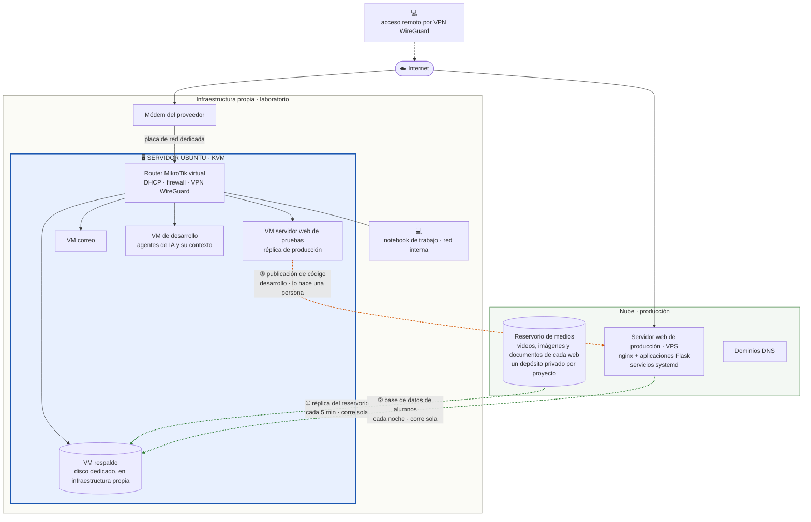
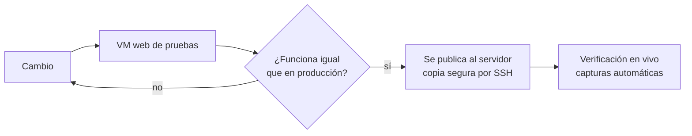
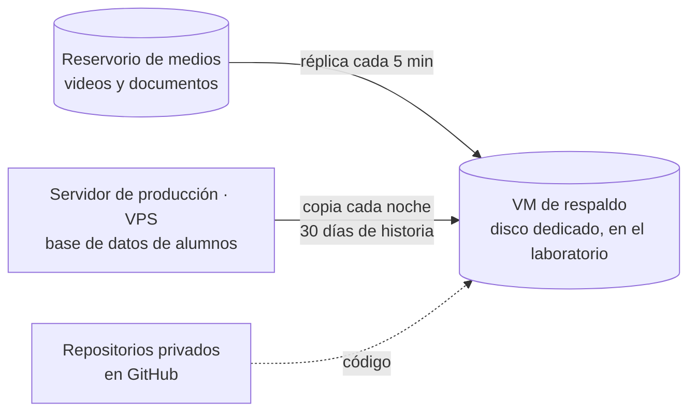

# Infraestructura DruidaTech — laboratorio propio y producción en la nube

La infraestructura sobre la que corren los proyectos web de DruidaTech: un
laboratorio en hardware propio para desarrollar y probar, y en la nube, para
producción, un servidor alquilado (VPS) y un reservorio de medios donde viven
los videos y documentos de cada proyecto. Toda la infraestructura, del
laboratorio a la nube, la diseñó, la montó y la opera **Edgardo Rodríguez**.

**Proyectos que corren sobre esto:**

- [artedehoy-web](https://github.com/druidatech-net/artedehoy-web): sitio y
  plataforma de cursos en video de una academia de arte.
- [edgardoviajero.com](https://edgardoviajero.com): sitio y tienda de un libro
  de fotografía, con visor protegido, venta de láminas e impresión bajo demanda.

---

## La idea en una frase

Cada web se desarrolla y se prueba en el laboratorio, en hardware propio. Cuando
su funcionamiento está probado, pasa a la nube y entra en producción. El
servidor de correo, en cambio, queda de forma permanente en infraestructura
propia.

---

## Cómo está armado

Las líneas punteadas son los únicos movimientos entre la nube y el laboratorio,
y son de dos clases distintas. **En verde, la operación:** ① y ② corren solas,
por temporizador, y están explicadas en
[Operación: cómo viajan los datos](#operación-cómo-viajan-los-datos). **En
naranja, el desarrollo:** ③ es publicar un cambio de código, lo hace una
persona, y está explicado en [Cómo se prueba antes de subir](#cómo-se-prueba-antes-de-subir).

---

## El laboratorio

**Un solo equipo, que es el servidor.** Una PC configurada como servidor, con
ocho núcleos y treinta y dos gigabytes de memoria, con Ubuntu, dedicada a dos
cosas: alojar las máquinas virtuales con KVM y servir los archivos de la red.

**El trabajo se hace desde una notebook** conectada a la red interna. Desde ahí
se entra a la máquina de desarrollo y al resto. Y cuando esa misma notebook
está afuera, entra por la VPN WireGuard: mismo puesto de trabajo, adentro o
lejos.

**Cinco máquinas virtuales**, que arrancan solas con el equipo:

| Máquina | Para qué |
|---|---|
| Router MikroTik virtual | El router de entrada de toda la red, con su licencia: recibe la conexión del proveedor por una placa dedicada y hace DHCP con reservas, firewall, apertura de puertos y la VPN WireGuard de acceso remoto. |
| Servidor web de pruebas | Réplica del entorno de producción: mismo nginx, mismas aplicaciones, mismos servicios. Lo que funciona acá, sube. |
| Correo | Servidor de correo completo y propio para todos los dominios del proyecto DruidaTech: buzones, webmail y autenticación del dominio (SPF, DKIM y DMARC), sin depender de un proveedor. |
| Respaldo | Guarda, en un disco dedicado, las copias de lo que vive en la nube: el reservorio de medios (los videos y documentos de cada proyecto, replicados cada cinco minutos) y la base de datos de alumnos de cada academia (copiada cada noche, con treinta días de historia). |
| Desarrollo | La máquina donde viven los agentes de inteligencia artificial que asisten el desarrollo y la operación, con todo su contexto: los proyectos, la documentación y las herramientas con las que trabajan. Está adentro de la red, no en internet, y se entra desde cualquier lugar por la VPN: el trabajo sigue igual desde la notebook, de viaje o desde otra ciudad. |

**La red.** El módem del proveedor entra por una placa de red dedicada del
servidor, y el router de entrada es el MikroTik virtual que corre en ese mismo
equipo. Él gobierna todas las máquinas por el puente interno. Cada una recibe
su dirección por DHCP con reserva en el router; ninguna lleva dirección fija
adentro. Es una regla fija: la red se administra desde un solo lugar.

**Acceso remoto.** Desde afuera se entra a la red por una VPN WireGuard que
termina en el router virtual. Ningún panel ni máquina del laboratorio está
expuesto a internet: lo único que escucha desde afuera es la VPN y los puertos
del correo. Con la VPN levantada, la máquina de desarrollo, con sus agentes, y el
resto de las máquinas se usan desde cualquier lugar como si se estuviera en el
laboratorio.

Una decisión de diseño sostiene ese router virtual:

- **Arranca primero.** Es la primera máquina virtual que levanta con el servidor;
  hasta que no está, ninguna otra sale a la red. Un reinicio del equipo devuelve
  la red sola, en el orden correcto.

**Un disco que el servidor no ve.** El disco de respaldo pertenece a una sola
máquina virtual. Si el servidor lo montara mientras la VM lo usa, el sistema de
archivos se corrompe. Una regla de udev lo esconde del automontaje del
escritorio, identificándolo por su número de serie y no por su letra, que
cambia. Está en [`codigo/99-disco-solo-vm.rules`](codigo/99-disco-solo-vm.rules).

---

## Cómo se prueba antes de subir

La VM de pruebas corre el mismo nginx, las mismas aplicaciones y los mismos
servicios que el servidor de producción. Un cambio se prueba ahí, se verifica
con capturas automáticas del navegador, y recién después se copia al servidor
por SSH. Si algo se rompe, se rompe en el laboratorio.

**La publicación (③ en el diagrama principal) la hace el desarrollador:**
copia el cambio al servidor de producción por SSH y reinicia el servicio.

El mismo camino se usó para piezas más grandes. La conversión de video a
streaming adaptativo, por ejemplo, nació y se ajustó en el laboratorio; cuando
funcionó, se mudó al VPS con las mismas reglas.

---

## La nube

**El servidor (VPS).** Una máquina virtual de dos gigabytes de memoria en
Santiago de Chile, por menos de doce dólares al mes. Aloja varios sitios y sus
aplicaciones, cada una como servicio de systemd detrás de nginx. HTTPS con
certificados que se renuevan solos. Un freno automático a los intentos de
entrada repetidos. Un watchdog que reinicia lo que se cuelga.

**Almacenamiento de objetos.** Un depósito privado por proyecto, compatible con
S3. Videos, imágenes y documentos viven ahí, no en el servidor, y se entregan
por enlaces firmados que vencen.

**DNS por API.** Los dominios se administran por comando, no por panel, y cada
cambio se verifica con una consulta antes de darlo por hecho.

**Vigías.** Es el nombre que usamos para las tareas de fondo que un
temporizador de systemd ejecuta cada pocos minutos: despiertan, revisan si hay
algo pendiente, lo hacen y vuelven a dormir. Si una vuelta falla, la siguiente
lo retoma. En este servidor hay tres. El vigía de conversión de video es un
script de Linux escrito en Bash, y está publicado en
[`codigo/vigia-cocina.sh`](codigo/vigia-cocina.sh): hace una sola pregunta por
video, "¿ya está convertido?", y si no, lo convierte. Los otros dos son de la
tienda del libro y fueron creados como programas en Python: uno sigue los
pedidos de impresión y otro lee la casilla de reclamos.

---

## El reservorio de videos

Las clases en video son el producto de una academia, y son pesadas. No viven en
el servidor: viven en el reservorio, un depósito privado de almacenamiento de
objetos, uno por proyecto.

- **Nada se sirve por dirección fija.** La aplicación decide quién puede ver qué
  y entrega enlaces firmados que vencen. El video viaja del reservorio al
  reproductor sin pasar por el servidor web.
- **Cada video se convierte solo.** El vigía de conversión, que en este caso es
  un script de Linux en Bash ejecutado por temporizador, revisa el reservorio,
  encuentra los videos sin convertir y los deja en tres calidades, en
  fragmentos, para streaming adaptativo. El original nunca se toca.
- **Todo tiene copia.** El reservorio se replica cada cinco minutos en el
  laboratorio, en la máquina de respaldo.

Cómo se protege ese contenido, con el código de la entrega firmada, está contado
en [artedehoy-web](https://github.com/druidatech-net/artedehoy-web#el-reservorio-de-videos-y-c%C3%B3mo-se-cuida).

---

## Correo propio, en infraestructura propia

El correo de todos los dominios del proyecto DruidaTech corre en un servidor propio, en
infraestructura propia: buzones, webmail y la autenticación del dominio que hace que los
mensajes lleguen y no caigan en spam. Es la única pieza de producción que sigue
en infraestructura propia, por decisión propia, y la que más cuidado de red exige: es el servicio
que primero prueba cualquier atacante.

---

## De la infraestructura propia a la nube

Todo empezó en infraestructura propia: las webs se servían desde el
laboratorio, con dirección dinámica y puertos abiertos en doble NAT. Funcionaba, pero cualquier corte de
luz o de internet apagaba los sitios.

En agosto de 2026 la producción se mudó a la nube, por fases y sin cortes:
primero los archivos al almacenamiento de objetos, después la conversión de
video, después los sitios y sus aplicaciones. Cada fase con una prueba de fuego
al final: apagar las máquinas del laboratorio y verificar, desde un teléfono
con datos móviles, que todo seguía andando.

El laboratorio quedó con tres roles: desarrollar y probar, guardar las copias,
y el correo.

---

## Operación: cómo viajan los datos

Son los movimientos de datos del funcionamiento diario de los sitios. Todos
corren solos, por temporizador, sin que nadie intervenga.

### ① Réplica del reservorio, cada 5 minutos

Es la copia de seguridad de los videos y documentos. Funciona así:

1. **El dueño de la academia sube un video desde su panel de administración.**
   Queda guardado en el reservorio, en la nube.
2. **La aplicación de ese panel, en Python, lo anota en una lista de pendientes.**
   Un renglón que dice "hay un archivo nuevo en tal lugar". Esa lista vive en
   el mismo reservorio. Si se borra un archivo, el renglón dice "se borró".
3. **Cada cinco minutos, la VM de respaldo del laboratorio lee la lista.** Copia
   a su disco lo que figura como nuevo, borra lo que figura como borrado,
   verifica que la copia esté bien, y tacha el renglón. Tachar es la confirmación.
4. **Si algo falla, el renglón queda sin tachar** y se vuelve a intentar a los
   cinco minutos. Si el laboratorio está apagado, la lista espera y se procesa
   cuando vuelve.

Dos cosas importan de esto. La copia de seguridad va aparte del sitio: si la
máquina de respaldo está apagada o se atrasa, el video igual quedó subido y los
alumnos lo ven normal. Y cada cinco minutos no se copia todo el reservorio, que
son muchos gigabytes: se copia solo lo que se subió o se borró desde la última
vez. Por eso es rápido y barato.

### ② Base de datos de alumnos, cada noche

Un segundo guion en la VM de respaldo corre una vez por día y trae, por SSH,
una copia consistente de la base de datos de alumnos de cada academia (y de la
base de compras de la tienda del libro), desde el servidor donde vive. Se
guarda con fecha y se conservan treinta días.

**La conversión de video** no cruza entre nube y laboratorio: ocurre adentro
de la nube. El vigía de conversión, un script de Linux en Bash que llama a
ffmpeg, es ejecutado por un temporizador cada diez minutos en el servidor de
producción: busca en el reservorio los videos sin convertir y los deja en tres
calidades para streaming adaptativo.

---

## Qué corre solo (procesos automáticos)

Nadie tiene que subir, bajar ni convertir nada a mano para que un sitio
funcione:

| Qué | Quién lo hace | Cada cuánto |
|---|---|---|
| Un video nuevo se convierte a streaming adaptativo | El vigía de conversión: un script de Linux en Bash, ejecutado por temporizador de systemd | Cada 10 minutos |
| Un video se entrega a un alumno | La aplicación, con un enlace firmado | Al momento |
| Cobros, correos automáticos y certificados | La aplicación | Al momento |
| Pedidos de impresión y reclamos (tienda del libro) | Sus dos vigías: programas en Python, ejecutados por temporizador de systemd | Cada 10 y cada 5 minutos |
| Réplica del reservorio de medios al laboratorio | Temporizador en la VM de respaldo | Cada 5 minutos |
| Copia de la base de datos de alumnos al laboratorio | Temporizador en la VM de respaldo | Cada noche, con 30 días de historia |
| Certificados HTTPS | Renovación automática | Cuando corresponde |
| Un servicio que se cuelga | El watchdog lo reinicia | Al momento |

El dueño de cada academia sube su contenido desde el panel de administración
y se olvida. Todo lo demás ocurre en forma automática, y si una vuelta falla,
la siguiente lo retoma.

---

## Respaldos

| Qué | Dónde vive | Copia |
|---|---|---|
| Código | Servidor | Repositorios privados en GitHub |
| Base de datos de alumnos | Servidor | Cada noche a la VM de respaldo, con treinta días de historia. |
| Videos y documentos | Reservorio de medios | Réplica cada cinco minutos a la VM de respaldo |

La copia sale de la nube y entra al laboratorio, nunca al revés. Si la nube
desaparece, todo está en el laboratorio. Si el laboratorio desaparece,
producción no se entera.

---

## Lo que sigue

El servidor está migrando a **Proxmox**. Antes de tocar el disco real, la migración
se ensayó completa dentro de una máquina virtual, con un clon del sistema. El
ensayo encontró cuatro problemas que en el corte real hubieran costado una
noche: un cargador de arranque mal apuntado, un kernel roto heredado, una
referencia a un disco que ya no existía y un servicio que no arrancaba solo. Se
corrigieron en el ensayo. El corte real se hace con esos cuatro ya resueltos.

---

## Con qué está hecho

| Capa | Herramienta |
|---|---|
| Virtualización | KVM con libvirt; migración a Proxmox en curso |
| Red | MikroTik RouterOS virtual como router de entrada, VPN WireGuard para acceso remoto |
| Servidor web | nginx, HTTPS con Let's Encrypt |
| Aplicaciones | Python con Flask, gunicorn, servicios systemd |
| Medios | Almacenamiento de objetos compatible con S3 |
| Video | ffmpeg, streaming adaptativo HLS |
| Vigilancia | Vigías (un script en Bash y dos programas en Python, por temporizador de systemd), watchdog, fail2ban |
| Verificación | Capturas automáticas del navegador antes y después de cada cambio |
| Respaldo | Réplica del reservorio y copia diaria de la base de datos de alumnos a un disco dedicado |

---

## Qué se muestra acá y qué no

Este repositorio cuenta el diseño. Contiene los diagramas, la explicación y dos
piezas de código reales:

| Archivo | Qué es |
|---|---|
| [`codigo/vigia-cocina.sh`](codigo/vigia-cocina.sh) | El vigía de conversión: script de Linux en Bash que revisa el reservorio y convierte los videos pendientes |
| [`codigo/99-disco-solo-vm.rules`](codigo/99-disco-solo-vm.rules) | La regla que esconde el disco de respaldo al servidor |

No contiene direcciones de red, nombres de máquinas, números de serie,
credenciales ni rutas internas. Es un caso de estudio, no un mapa.

---

## Derechos

El código está bajo [licencia MIT](LICENSE). Ver [DERECHOS.md](DERECHOS.md).

Código © 2026 DruidaTech (Edgardo Rodríguez)

Diseñado y operado por **Edgardo Rodríguez** · [DruidaTech](https://druidatech.net)
